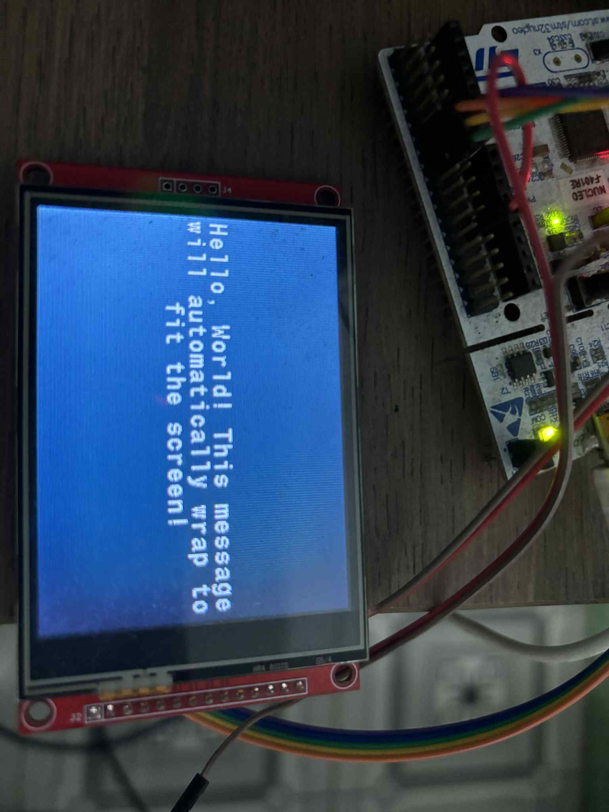

# LCD Layout Script Framework

This project provides a markup-like scripting system for defining and rendering the layout of LCD screens in embedded systems.
The layout script is converted into an object file (`.o`) and linked to the final firmware binary using the ARM GCC toolchain.

## 🧩 Overview

The goal of this project is to separate **UI layout definitions** from the firmware code, allowing developers to easily modify or extend screen layouts without touching embedded C source files.

### Key Features
- **Markup-like script** to define LCD layouts (similar to QML)
- **Static linking**: the script is converted into an object file and linked to firmware (`.hex`)
- **Automatic text wrapping**: long text lines are automatically split to fit the screen width
- **Supports image references** (e.g., fonts)
- **Lightweight parser** for embedded systems (no dynamic memory)
- **Scalable design** for multiple LCD devices and display drivers

## 🖋️ Example Script Format

```text
Layout {
    id: welcome
    Area {
        Text {
            font: small
            color: white
            background: black
            align: left
            text: "Welcome to the Embedded LCD Framework! This message will automatically wrap to fit the screen."
        }
    }
}
```

### Explanation
- `Layout` → top-level container, identified by id
- `Area` → defines a region or section on the screen
- `Text` → defines text attributes such as font, alignment, content, and color

### Result



### 🔍 Supported Attributes

| Attribute    | Description                                           | Example                |
|--------------|-------------------------------------------------------|------------------------|
| `id`         | Unique name of the layout                             | `id:welcome`           |
| `font`       | Font style or size (e.g., `large`, `medium`, `small`) | `font:medium`          |
| `text`       | Text content to display (use quotes if contains spaces)| `text:"Hello"`         |
| `align`      | Text alignment (`left`, `center`, `right`)            | `align:center`         |
| `color`      | Foreground color (RGB565 or name, e.g., `0xFFFF`)     | `color:white`          |
| `background` | Background color                                      | `background:black`     |


### ✅ Syntax Rules

| Rule          | Example                                       | Valid         |
|---------------|-----------------------------------------------|---------------|
| Use `:` to assign value       | `font:medium`                 | ✅            |
| Quotes required for spaces    | `text:"Hello World"`          | ✅            |
| Equal sign `=` not allowed    | `font=medium`                 | ❌            |

---

## ⚙️ Build Process

1. Convert the layout script to an object file:
```bash
cd Applications/LCD/Tools
python tml2obj.py
```

2. Run the make command to compile and link:
```bash
make clean
make -j4
```

---

## 🧩 Integration in Code

To use a layout in your firmware project:

Define your desired layout in layout.tml.

Run the Python script to generate the .o file automatically (the Makefile already includes the conversion step).

In your C code, reference the layout by its ID.

### Calling a Layout

You can pass parameters such as font type, alignment, or colors inline using semicolon-separated key-value pairs:

```c
Display_LoadLayout("id:layout_name;font:small;align:left");
```

### Syntax rules:

- Each pair has the form `key:value`

- Pairs are separated by `;`

- The first key must be `id`, followed by any number of additional parameters

### Example meaning:

- `id:welcome` → specifies which layout to load

- `font:small` → sets font type or size

- `align:left` → sets text alignment

- `color:white` → sets foreground text color

- `background:black` → sets background color

This allows you to customize layout properties at runtime without modifying .tml files.

---

